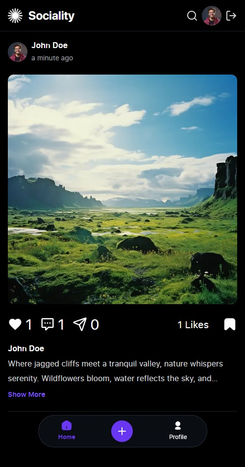
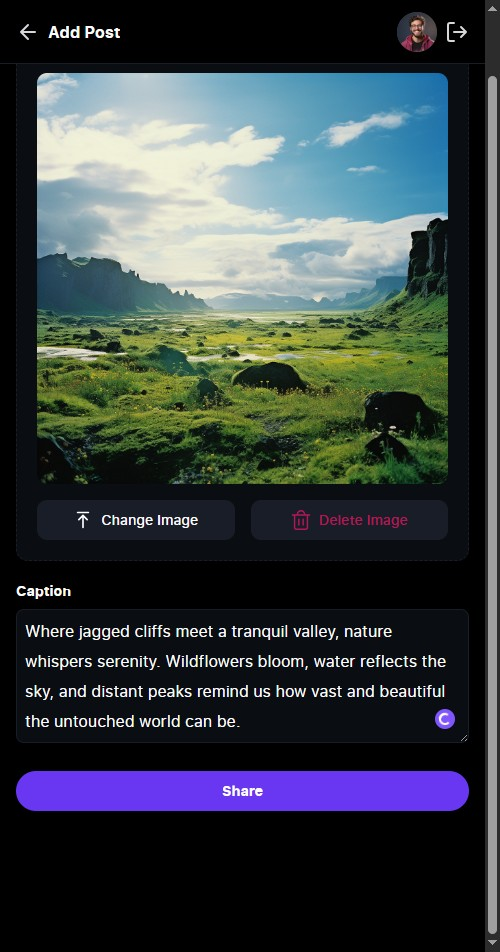

# 📱 Sociality — Social Media Web App

A modern, scalable **React + TypeScript + Vite** Social Media Application built with atomic design principles.  
This project is designed to be **audit‑ready**, mentor‑compatible, and focused on clean architecture.

---

## 🌐 Live Demo

👉 Try the application here: [Sociality Web](https://socialmediaappnextjstypescripttailw.vercel.app/)

Use the following dummy account to log in and explore the features:

- **Email:** `johndoe@example.com`  
- **Password:** `123456`

---

## ✨ Features

- 🔐 Authentication (Register, Login, Forgot Password)  
- 📝 Create, edit, and delete posts  
- 💬 Comment system with optimistic updates  
- ❤️ Like & Save posts (localStorage persistence)  
- 👥 Follow & Unfollow users with instant stats sync  
- 🔍 Search bar for users & posts  
- 📂 User Profile with activity & stats  
- 📰 Infinite scroll feed with empty state logic  
- 🎨 Responsive UI (Mobile ≤393px, Desktop ≥md)

---

## 🛠 Tech Stack

- ⚛️ **Next.js + TypeScript → core framework & dev server 
- 🎨 **Tailwind CSS + shadcn/ui** → styling & UI components  
- 🔄 **Redux Toolkit** → global auth state (token, user info)  
- 📡 **TanStack Query** → API fetching & caching  
- ⏰ **Day.js** → date formatting & validation  
- 📬 **Axios** → API client  
- ✅ **Zod + React Hook Form** → form validation & type safety  
- 🔄 **Optimistic UI** → instant feedback for likes, comments, follow/unfollow  
- 🛠 **Next.js routing (if Next) → multi‑page navigation (Feed, Profile, Search, Login, Register)

---

## 📸 Preview Sociality App

### 🏠 Feed Page  

### 📝 Add Post Page  

### 📖 Detail Post Page  

### 💬 Comment Page  

### 👤 Profile Page  

### 🧾 Profile Fill Page  

### 🛠️ Edit Profile Page  

### 🔐 Login Page  

### 📝 Register Page  

---

## 📌 Notes

- Breakpoints: Mobile ≤393px, Desktop ≥md  
- Optimistic UI for likes, comments, and follow actions  
- Audit‑ready commit logs with clear breakdown per feature  
- Client‑only components for identity & browser API access
